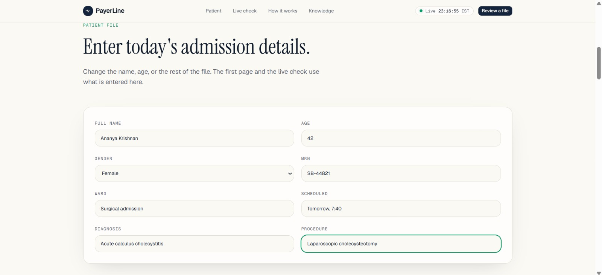
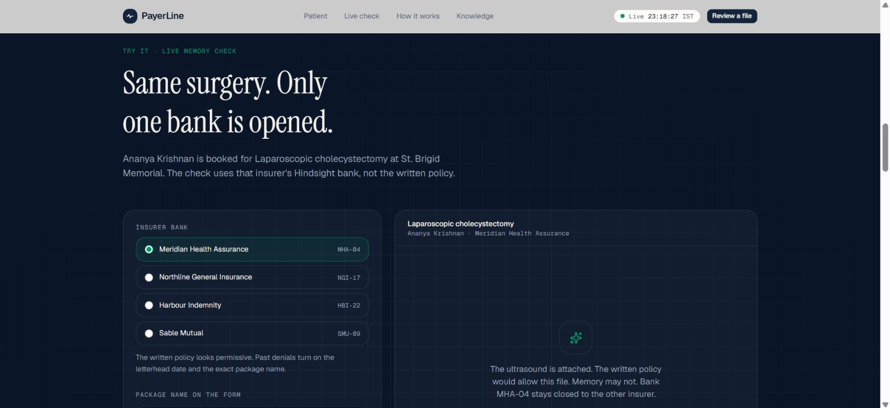
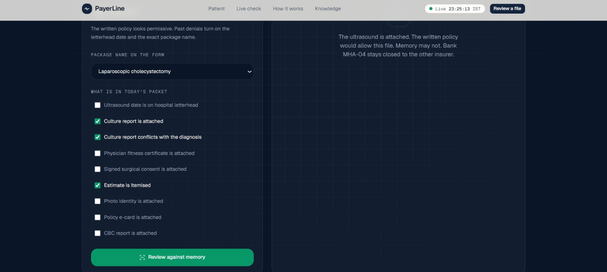
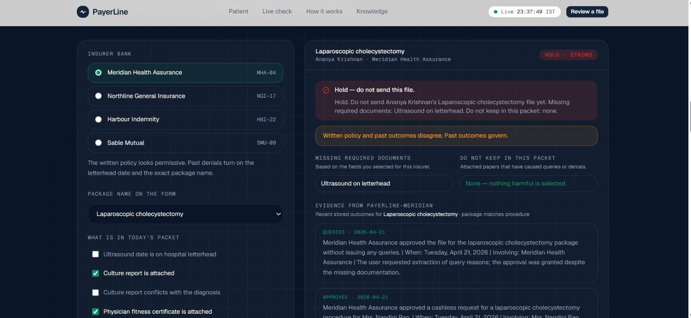
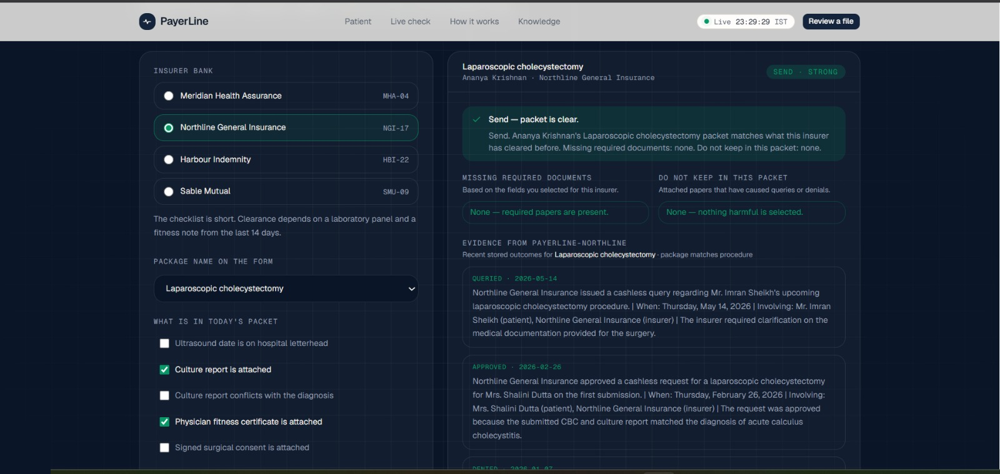

# When Historical Outcomes Matter More Than Checklists

Four insurers publish nearly the same cashless policy for the same surgery, and each one denies files for a completely different reason. One of them denied a packet because the ultrasound date was on the radiology printout instead of hospital letterhead. Another approved a packet with the wrong package name and the wrong letterhead, then held the next one over a fitness note that was seven days too old.

None of that is in any policy PDF. I built PayerLine to stop the cashless desk at a hospital from learning it the hard way, using [Hindsight agent memory](https://github.com/vectorize-io/hindsight) as the source of truth instead of the written rules.

## What the system does

Before a hospital sends a cashless pre-authorisation file to an insurer, someone on the desk has to decide whether the packet is ready. If it goes out wrong, the insurer denies or queries it, the patient is held overnight, and the theatre slot slips. In practice the answer to "is this packet ready?" lives in the head of one senior billing person who remembers what each insurer did last time.

PayerLine is an advisory tool for that decision. The desk enters today's patient and builds the packet: package name, ultrasound, culture report, fitness note, consent, estimate, identity papers, CBC. PayerLine returns **hold** or **send**, a short list of documents to fix, a list of documents to leave out, and the past cases it relied on.

It does not diagnose, and it does not submit anything. A person still sends the file.



The stack is small. An Express API in TypeScript talks to Hindsight Cloud through `@vectorize-io/hindsight-client`. A Next.js desk UI proxies to it. Groq, using function calling, turns a free-text clinical note into structured admission fields. Everything interesting happens in a few hundred lines under `server/` and `shared/`.

## The through-line: one insurer, one bank

The decision that shaped everything was to give each insurer its own memory bank and never let them mix.

This sounds obvious, but the failure mode of a shared memory is nasty. Meridian and Northline handle the same procedure and want opposite things:

- Meridian denied a file because the package name said "management" instead of "laparoscopic cholecystectomy". Northline approved a file with the package name "management", and did not care about letterhead at all.
- Meridian queried a file *because* an extra culture report was attached. The report showed no growth and mentioned an unrelated urinary finding. Northline denied a file for having no culture report.

A single store that learns "culture reports are good" or "package names matter" will confidently give the wrong advice for half the insurers. So there are four banks (`payerline-meridian`, `payerline-northline`, `payerline-harbour`, `payerline-sable`), and every recall and reflect call is scoped to exactly one of them. Same procedure, opposite documents, separate memory.



## What goes into a bank

Each bank holds two kinds of documents: the insurer's written policy, and dated outcomes. Every outcome is a plain-language record of what the insurer did and why. Here is the shape of one, from the Meridian seed history:

```ts
{
  payerId: "meridian",
  documentId: "meridian-2026-03-02",
  timestamp: "2026-03-02T16:30:00Z",
  context: "cashless query caused by a contradictory laboratory report, Meridian Health Assurance",
  tags: [procedure, "outcome:queried"],
  content: `On 2 March 2026 Meridian Health Assurance queried ... laparoscopic cholecystectomy ...
The letterhead date and package name were correct, so those were not the problem.
An extra culture report was attached. The report described no growth and mentioned an unrelated urinary finding.
...
Adding that culture report made the file worse, not better.`,
}
```

Two details here took me a while to get right.

First, `documentId` is stable and retain runs with `updateMode: "replace"`, so re-seeding a bank overwrites documents instead of duplicating them:

```ts
await api.retain(payer.bankId, item.content, {
  timestamp: item.timestamp,
  context: item.context,
  documentId: item.documentId,
  tags: item.tags,
  updateMode: "replace",
});
```

Second, retain is asynchronous. If you write a batch of outcomes and immediately ask the bank a question, you are asking it before it has finished reading. I poll the operation endpoint until it completes, and fail loudly if it errors or times out, rather than letting a half-retained bank return a confident answer.

## Teaching the bank how to think about this

The bank configuration matters as much as the data. Each bank gets a retain mission that tells Hindsight what to extract from an outcome (denial reasons, document defects, package names, the change that later won approval) and what to ignore (greetings, scheduling chatter). It also gets an observations mission, which is where the interesting part lives:

```ts
observationsMission:
  "Observations are durable rules about what this insurer actually approves or rejects. " +
  "Keep the document defect, the package name, and the outcome. " +
  "Revise a rule when a newer outcome contradicts it. " +
  "Leave out one-off patient details that do not change the next file.",
dispositionSkepticism: 5,
dispositionLiteralism: 5,
dispositionEmpathy: 2,
enableObservations: true,
```

I wanted the bank to consolidate individual outcomes into rules ("this insurer denies on X") and to revise a rule when a newer outcome contradicts it. The disposition settings push the reflecting model toward literal, skeptical reading of the record. This is not a bedside-manner problem.

On top of that sit seven directives, and they are the guardrails I would keep even if everything else changed. A few of them:

- **Clinical boundary:** never recommend or question the treatment; only judge whether the packet should go out.
- **Evidence threshold:** do not invent an insurer rule from one case. Fewer than two agreeing outcomes means confidence is `thin`.
- **Policy conflict:** when past outcomes contradict the written policy, follow the outcomes and say so.
- **Disagreement:** if two past cases disagree, show both and lower the confidence instead of collapsing them into one rule.

The "written policy loses to outcomes" rule is the whole product in one sentence. The Meridian policy says any clinically reasonable package name is acceptable. Two denials say otherwise. The bank believes the denials.

## Recall, reflect, and the recent record

A review call fans out three reads in parallel against the one insurer's bank:

```ts
const [recalled, reflection, outcomes] = await Promise.all([
  recallCase(admission.payerId, query, admission.procedure),
  reflectCase(admission.payerId, query, admission.procedure),
  loadRecentOutcomes(admission.payerId, admission.procedure, admission.packageName),
]);
```

Recall pulls the memories most similar to today's packet, filtered by a `procedure:` tag so a cholecystectomy file is not judged against unrelated surgeries. Reflect asks the bank to reason over those memories and return a structured decision against a JSON schema: `decision`, `confidence`, `policy_conflict`, `summary`, `fixes`, `do_not_add`, and `evidence`. I also read back the most recent dated outcomes so the desk sees the actual approvals and denials next to the advice. A recommendation with no visible history behind it is easy to dismiss, and it should be.

The query I send is built from the packet itself: every document, present or absent, is spelled out in plain sentences, along with instructions to hold if the written policy would allow the file but past outcomes would not.



## Results: what the desk sees

Take a Meridian packet for an acute calculus cholecystitis patient. The package name on the draft is "management". The ultrasound date is on the radiology printout. A culture report is clipped to the file showing no growth and an unrelated urinary finding.

The written policy says all of that is fine. The bank says hold:

- **Fix:** Package name: laparoscopic cholecystectomy, Ultrasound on letterhead.
- **Leave out:** Conflicting culture report.
- **Evidence:** the November denial for letterhead and package name, the repeat denial in January, the March query caused by the culture report, and two approvals where the desk did the opposite.



Now change the insurer on the same physical packet to Northline. The letterhead and package name stop mattering. The bank asks for a CBC, a matching culture report, and a fitness note from the last 14 days. Same documents on the desk, different answer, because the memory belongs to a different insurer.



When the insurer replies, the desk records it. `POST /api/outcome` writes the packet's exact state, the outcome, and the desk's stated reason back into the same bank as a new retained document, tagged `outcome:denied`, `outcome:approved`, or `outcome:queried`. The next file for that insurer starts with that outcome already in memory. There is no rules file to edit and no ticket for engineering.

## The part I like least

PayerLine's final answer does not come straight from reflect. There is a small deterministic function, `assessPacket`, that computes the missing and removable documents for each insurer, and the review path overrides the model's decision, fix list, and summary with its result:

```ts
return {
  ...decision,
  decision: checklist.mustHold ? "hold" : "send",
  fixes: checklist.missingRequired,
  doNotAdd: checklist.removeFromPacket,
  summary: checklist.message,
};
```

I added it because I wanted the same packet to always produce the same message. A desk that sees "hold" on one click and "send" on the next stops trusting the tool, and that trust is the whole game.

The uncomfortable part is that this is a checklist, and this article's title argues against checklists. It is a checklist derived from outcomes rather than from policy, which is why it exists at all, but it still duplicates knowledge that lives in the bank. If an insurer changes its behavior, the memory adapts after one retained outcome and the hardcoded rule does not. The direction I am taking this is to generate that gate from the bank's own observations, so memory stays the single source of truth and determinism comes from how we consume it.

## Lessons learned

**1. Scope memory to the entity whose behavior you are learning.** One bank per insurer removed an entire class of cross-contamination bugs. If two customers, vendors, or counterparties contradict each other, they should not share a store.

**2. Store what happened and why, not a summary of the rule.** The most useful memory in the system is a paragraph about a specific file, the specific reason it was queried, and what fixed it. Rules can be derived. Lost context cannot.

**3. Put your escalation rules in directives, not prompts.** "Do not infer a rule from one case" and "show disagreement instead of collapsing it" live in bank directives, so they apply to every reflect call without me remembering to include them.

**4. Wait for retain before you read.** Asynchronous retain plus an eager recall equals a confident answer built on stale memory. Poll the operation.

**5. Decide where determinism belongs.** Memory should decide what is true. Code should decide how consistently it is presented. Mixing the two, as I did, works, but it is a debt you should take on with your eyes open.

## Where this goes

Written policy is a claim the insurer makes. Outcomes are what the insurer does. A cashless desk cares about the second one, and it is the one nobody writes down. [Hindsight](https://github.com/vectorize-io/hindsight) gave me a place to write it down once per insurer and have every later decision inherit it.

If you are building something similar, start with the [Hindsight documentation](https://hindsight.vectorize.io/) for banks, directives, and observations, and read Vectorize's overview of [what agent memory is](https://vectorize.io/what-is-agent-memory) before deciding what should be remembered and what should be recomputed.
